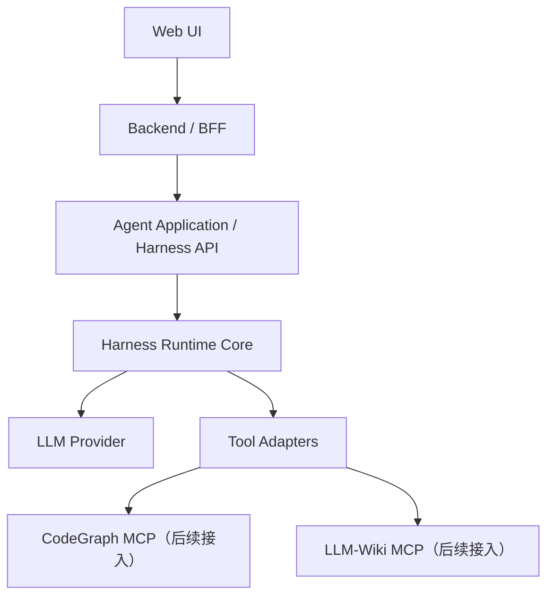

# Agent Harness 重写开发指导（交给 Codex）

> 版本：0.1（讨论确认稿）  
> 目标：在现有工程中按模块重建 Agent Harness，并逐步接入 Web UI、Backend、CodeGraph MCP、LLM-Wiki MCP。  
> 使用方式：先检查仓库现状和本文约束，再按阶段实现。不要一开始一次性重写所有模块。

## 1. 项目目标

建设一套用于软件开发、问题解决和设计文档撰写的 Agent 系统。V1 的重点是建立可靠、可观察、可取消、可恢复的单 Agent 运行内核，并完成 Web UI、Backend、Harness 的端到端闭环。CodeGraph MCP 和 LLM-Wiki MCP 暂不重写，先保留标准工具接入点，后续再分别接入。

系统需要支持：

- OpenAI 兼容模型接口，默认模型服务可通过配置替换。
- Agent Loop：模型请求、流式接收、工具调用、工具结果回填、继续运行或结束。
- 单任务 Session、运行状态、事件记录和上下文构造。
- 动态工具目录与每轮工具暴露；工具调用并行策略、超时、取消和错误处理。
- 从模型流到 Harness 事件、Backend SSE、Web UI 的端到端流式传输。
- 每次模型请求的 Prompt 分项大小、Token 使用量、首 token 时间、总耗时和工具耗时日志。
- 以后支持 Coordinator 创建多个 Agent 子运行，但 V1 不实现完整多 Agent 调度。

## 2. 总体架构与职责



### 2.1 Web UI

- 技术：React + TypeScript + Vite；优先延续现有项目约定，不额外引入重量级 UI 框架。
- 负责输入任务、展示文本增量、工具调用状态、任务终态、错误、取消控制和最终产物。
- 只与 Backend 通信，不直接调用 Harness、LLM 或 MCP。
- SSE 事件只解析项目定义的事件协议，不绑定 Pi、OpenAI SDK 或 MCP SDK 的内部事件名。

### 2.2 Backend / BFF

- 技术：Python 3.12、FastAPI、Pydantic 2、异步接口。
- 负责鉴权、用户/项目权限、任务 API、任务与运行 ID 映射、对 UI 提供 SSE、转发取消/状态查询。
- 不负责 Agent Loop、Prompt 组装、MCP 工具调用或多 Agent 调度。
- 对外 REST API 由 FastAPI OpenAPI 描述；前端类型应从 API 契约生成或通过契约检查，避免手写漂移。

### 2.3 Agent Application / Harness API

- Python 3.12；提供给 Backend 的内部控制接口。
- 管理 Run 生命周期，选择 Workflow / Skill / 工具集，启动单 Agent Runtime，并将标准事件持久化。
- V1 使用 HTTP 内部 API；Backend 不直接 import Harness 私有模块。
- 服务内可以先用 asyncio worker + 并发限制；暂不引入 Redis、Celery 或消息队列。

### 2.4 Harness Runtime Core

- Python 3.12、asyncio、Pydantic 2；实现 Pi 风格的显式 Agent Loop。
- V1 不叠加 LangGraph、OpenAI Agents SDK 等第二套 Loop/Workflow 引擎。
- 核心组件：`RunExecutor`、`ProviderAdapter`、`ContextBuilder`、`ToolCatalog`、`ToolPolicy`、`ToolExecutor`、`SessionStore`、`EventSink`、`UsageRecorder`。
- CodeGraph 和 LLM-Wiki 是工具适配器，不得把它们的业务语义写进 Agent Loop。

### 2.5 MCP 服务

- CodeGraph MCP 和 LLM-Wiki MCP 作为独立服务保留，本阶段不重写服务器。
- Harness 只依赖通用 `Tool` 接口；MCP Client Adapter 后续实现。
- 服务部署时优先评估 Streamable HTTP；本机子进程部署时可评估 stdio。根据现有 MCP 服务配置最终定案。

## 3. 公共概念与标识

不得把 Task、Session、Run、Turn 和 Tool Call 混为一个对象。

| 对象 | 含义 | V1 约束 |
|---|---|---|
| `Task` | 用户提交的一件工作 | 由 Backend 创建并授权；有用户、项目、任务类型和输入 |
| `Session` | 任务期间的对话记录 | 默认任务级 Session；允许用户补充信息后继续同一任务 |
| `Run` | 一次执行尝试 | 每次执行有独立 `run_id`；失败后重试创建新的 Run |
| `Turn` | 一次模型请求及响应 | 一个 Run 可包含多个 Turn |
| `ToolCall` | 模型要求执行的一次工具调用 | 有唯一 ID、参数、执行状态、结果引用和时延 |
| `Event` | 运行中发生的标准化事件 | 每个 Run 内单调递增序号，可供 SSE 续传 |
| `Artifact` | 大型工具结果、报告、diff 等产物 | 可按引用读取，避免把大型数据反复塞入 Prompt |

ID 建议使用 UUID/UUIDv7。任何日志、事件、指标至少带 `task_id`、`run_id`；Turn 及工具级数据再带 `turn_id`、`tool_call_id`。

## 4. Agent Loop 与运行状态

### 4.1 单 Agent 执行循环

```python
async def execute_run(run_id, session_id, initial_input):
    append_user_input(session_id, initial_input)
    while True:
        check_cancelled_and_budgets(run_id)
        request = await context_builder.build(run_id, session_id)
        await event_sink.emit(context_report_event(request.report))
        response = await provider.stream(request)
        await persist_assistant_response(response)
        if response.tool_calls:
            results = await tool_executor.execute_batch(response.tool_calls)
            await append_results_in_original_call_order(results)
            continue
        return await finalize_run(response)
```

真实代码必须处理增量流、部分工具参数、Provider 错误、取消、Run 上限、持久化错误和终态事件；上面仅表达控制顺序。

### 4.2 Run 状态

建议状态：

- `accepted`
- `running`
- `waiting_for_user`（需要审批或补充输入时）
- `completed`
- `failed`
- `cancelled`
- `interrupted`（进程退出时仍在运行）

终态必须有 `stop_reason`，例如 `final_answer`、`user_cancelled`、`max_turns`、`budget_exceeded`、`provider_error`、`tool_error`、`worker_interrupted`。不要用一个泛化的 `failed` 掩盖具体原因。

### 4.3 Run 控制接口

Harness 内部接口至少支持：

- `POST /internal/runs`：创建 Run，要求 `task_id` 和幂等请求键，尽快返回 `run_id`。
- `GET /internal/runs/{run_id}`：查询状态与终态信息。
- `POST /internal/runs/{run_id}/cancel`：取消当前 Run。
- `GET /internal/runs/{run_id}/events?after_sequence=N`：重放已有事件并跟随新事件。
- `POST /internal/runs/{run_id}/resume`：显式恢复或重新运行；不得自动重复执行不确定是否已完成的副作用工具。

接口使用版本化 JSON/Pydantic Schema；服务间调用必须有鉴权、超时、请求 ID 和错误码。

## 5. Session 与上下文管理

### 5.1 数据分层

| 层 | 保存内容 | 规则 |
|---|---|---|
| Session Log | 用户/模型消息、工具调用及结果 | 追加写入；不得覆盖原始历史 |
| Run State | 目标、范围、约束、当前计划、已确认发现、未解决问题 | 结构化保存；来源可追踪 |
| Project Knowledge | 架构文档、代码图谱、知识库资料 | 由外部索引/MCP 持有，按需查询 |
| Model Context | 单次请求实际发送的消息、工具 Schema 和证据 | 每个 Turn 重建并记录构造报告 |

### 5.2 ContextBuilder 组装顺序

每次 LLM 请求都经过一个可测试的 `ContextBuilder`，至少纳入：

1. 稳定的系统规则和输出约束。
2. 当前 Task 的目标、仓库/项目范围和用户约束。
3. 当前 Workflow / Skill 指令。
4. 本轮允许模型调用的工具定义。
5. 当前用户输入及必要的近期对话。
6. 与当前目标相关的旧消息、证据及已确认事实。
7. 必要的工具结果片段和 Artifact 引用。
8. 输出 Token 预留和安全余量。

不得把状态栏文本、时间、Token 计数等仅用于 UI/运行状态的数据自动注入 Prompt。只有会改变 Agent 决策的事实才进入上下文。

### 5.3 历史、压缩和超限策略

- V1 保留完整原始 Session Log，关闭不可逆/静默历史压缩。
- Context Builder 可以按相关性选择历史；“保存完整”不等于“每轮全部重发”。
- 大型工具输出保存为 Artifact；Prompt 使用有限相关片段、摘要和引用 ID。
- Prompt 仍超预算时，先丢弃重复/低相关的检索结果，再重新检索历史；不得拆断 assistant tool-call 与对应 tool-result 结构。
- 自动生成的派生摘要必须带原始条目引用，不能替代原始记录。V1 是否在超限时启用派生摘要需由配置控制，默认关闭。
- 上下文估算不足以继续时，产生可诊断的 `context_budget_exceeded` 错误或请求用户开始新任务；不得无声丢弃关键约束。

### 5.4 Prompt 分项尺寸与 Token 观测

每次模型请求前生成并持久化 `ContextBuildReport`，至少包含：

```text
request_id, task_id, run_id, turn_id, model, prompt_version
system_chars / system_tokens_est
workflow_skill_chars / workflow_skill_tokens_est
project_context_chars / project_context_tokens_est
history_chars / history_tokens_est
tool_schema_chars / tool_schema_tokens_est
evidence_chars / evidence_tokens_est
tool_result_chars / tool_result_tokens_est
user_input_chars / user_input_tokens_est
input_tokens_est, output_reserve, context_window, safety_margin
included_entry_ids, evidence_ids, active_tool_names, omitted_items_by_reason
```

Provider 响应后记录 `prompt_tokens_actual`、`completion_tokens_actual`、缓存 Token（Provider 支持时）、TTFT、总耗时和结束原因。估算和 Provider 实际值分开命名，不可混写。工具输出的完整内容和原始 Prompt 默认不写普通日志；日志保存尺寸、ID、版本和必要的脱敏诊断信息。

结构化日志示例：

```text
context.built task_id=... run_id=... turn_id=... model=...
  system_tokens_est=... workflow_skill_tokens_est=...
  history_tokens_est=... tool_schema_tokens_est=...
  evidence_tokens_est=... tool_result_tokens_est=...
  user_input_tokens_est=... input_tokens_est=...
  output_reserve=... context_window=... omitted_count=...
llm.completed task_id=... run_id=... turn_id=...
  prompt_tokens_actual=... completion_tokens_actual=...
  ttft_ms=... elapsed_ms=... tool_call_count=... stop_reason=...
```

Token 估算器通过 Provider/Model Adapter 注入；未有精确 tokenizer 时使用明确标注的估算值，并以模型服务返回的 usage 校准。

## 6. Tool 管理与并行调用

### 6.1 ToolSpec 与目录

每个工具注册 `ToolSpec`：

```text
name, description, input_schema, source
risk: read_only | workspace_write | command_exec | external_side_effect
parallel_safe: bool
idempotent: bool
concurrency_group: string | null
max_concurrency: int | null
timeout_seconds, max_result_bytes
requires_approval: bool
```

`ToolCatalog` 保存全量已知工具；`ToolPolicy` 根据任务、用户权限、仓库范围和风险过滤；每次模型请求使用冻结的 `ActiveToolset`。工具集变更在下一次模型请求明确生效，并写事件/ContextBuildReport。默认不把所有 MCP 工具 Schema 全部暴露给模型。

### 6.2 单次响应中的多工具调用

执行步骤：

1. 收齐模型流式输出中的完整工具名和参数；不能用未完成的 JSON 参数启动工具。
2. 校验工具存在、Schema、权限、工作区范围和调用预算。
3. 若整批调用都声明并经策略确认 `parallel_safe=true`，且无共享资源冲突，才并行执行；否则按原始顺序串行执行。
4. 同一 `concurrency_group` 使用 Semaphore/Lock 限制并发；MCP Server 默认并发能力未知，必须配置后才能并发。
5. 每个工具调用独立超时、错误捕获和事件记录；单个可恢复工具失败不丢弃其他调用结果。
6. 所有结果完成后，按原始 tool-call 顺序追加到模型对话，保证 call ID 与 result 对应，再启动下一 Turn。
7. 取消 Run 时取消所有尚未完成的工具任务；工具侧未确认取消的副作用必须记录为 `outcome_unknown`，不能假设回滚成功。

V1 并发数可配置，初始默认上限建议为 4，另设全服务总并发上限。未标记并行安全的工具默认串行。只对读操作和明确幂等的调用做有限重试；有副作用的工具禁止自动盲重试。

### 6.3 工具结果

统一返回：

```json
{
  "ok": true,
  "content": "模型可读的有限结果",
  "artifact_ref": null,
  "truncated": false,
  "error_code": null,
  "retryable": false
}
```

保存工具耗时、输入摘要、结果大小、状态、Artifact 引用和错误码。不能把原始 Python traceback、凭据或无限长命令输出返回给模型；内部诊断日志与模型可见错误分开。

## 7. 流式传输、事件与 SSE

### 7.1 端到端链路

```text
LLM Provider stream
→ ProviderAdapter 解析/规范化
→ Harness EventSink 持久化 Run Event
→ Backend 鉴权并代理事件流
→ Web UI 消费 SSE
```

ProviderAdapter 负责处理 Provider 特有的增量格式、部分 tool-call 参数、usage 和错误，并输出统一内部事件。完整工具参数校验通过后，ToolExecutor 才能执行。

### 7.2 Backend 对 UI 的接口

- `POST /api/tasks`：创建 Task，返回 `task_id`。
- `GET /api/tasks/{task_id}`：返回 Task/当前 Run 状态。
- `GET /api/tasks/{task_id}/events`：SSE 流。
- `POST /api/tasks/{task_id}/cancel`：取消当前 Run。
- 可选：`POST /api/tasks/{task_id}/resume`：显式继续。

Backend 是 UI 唯一入口。SSE 支持 `Last-Event-ID` 或 `after_sequence` 续传；设置心跳；连接断开不自动取消 Run；代理/反向代理关闭缓冲；前端收到终态或用户取消后关闭连接。

### 7.3 Event Envelope

```json
{
  "schema_version": 1,
  "event_id": "evt_...",
  "task_id": "task_...",
  "run_id": "run_...",
  "sequence": 12,
  "timestamp": "2026-10-09T12:00:00Z",
  "type": "assistant.delta",
  "payload": {"delta": "..."}
}
```

V1 事件类型：

- `run.accepted`、`run.started`、`run.phase_changed`
- `context.built`（面向诊断，可按权限决定是否对 UI 暴露详细分项）
- `assistant.delta`、`assistant.message`
- `tool.started`、`tool.progress`、`tool.completed`、`tool.failed`
- `approval.required`
- `usage.updated`
- `run.completed`、`run.failed`、`run.cancelled`、`run.interrupted`

不要输出模型隐藏推理过程。可以输出面向用户的阶段说明、工具活动和最终答案。

### 7.4 事件归属

- Harness 是 Run、Session、工具执行和 Run Event 的唯一权威写入方。
- Backend 是用户、项目权限、Task 与 `run_id` 关系的唯一权威写入方。
- Backend 可代理 Harness 事件，但不得把自己的转发记录冒充 Harness 原始 Run Event。
- SSE 断线重连通过 Harness 事件游标回放，不能依赖 Backend 内存队列。

## 8. Provider、预算与失败恢复

### 8.1 ProviderAdapter

- Loop 不直接依赖具体 LLM SDK/HTTP 响应结构。
- 默认实现接入现有 OpenAI 兼容端点；模型名、`base_url`、超时和并发从环境配置读取。
- 统一处理文本增量、tool-call 增量、finish reason、usage、HTTP 错误和限流错误。
- 记录 Provider 名、模型名和 API 配置版本；禁止记录 API Key。
- 用 Mock Provider 覆盖无 API Key 的测试。

### 8.2 预算

每个 Run 配置最大 Turn 数、最大 Tool Call 数、墙钟运行时间、单工具超时、Prompt token 目标、输出预留和成本上限（Provider 可提供时）。预算耗尽以明确终态和 `stop_reason` 结束，不允许无限循环。

### 8.3 崩溃、取消与重试

- 持久化状态至少包含 Run 启动、Turn 开始/结束、工具调用状态、Run 终态和序号化事件。
- Harness 重启后把无法证明仍在运行的 Run 标为 `interrupted`。
- V1 默认由用户显式重试/恢复；不自动从不确定的工具调用点重放副作用。
- Run 创建使用幂等键，避免 Backend 网络重试创建重复 Run。
- 服务取消向 Provider 和正在执行的工具传播 cancellation token；超时和取消需写终态事件。
- 不承诺跨任意进程故障的 exactly-once 工具执行；对副作用工具采用幂等键、审批或显式未知结果状态。

## 9. 持久化与存储

V1 建议 PostgreSQL，SQLAlchemy 2.x Async + Alembic。一个数据库集群可由 Backend/Harness 共用，但按 Schema/表和数据库账号划分所有权，不允许跨服务直接修改对方表。

- Backend 数据：用户/项目（若已有系统负责则复用）、Task、Task 权限、Task 到 Run 的映射。
- Harness 数据：Session、Session Entry、Run、Run Event、Tool Call、ContextBuildReport、Usage、Artifact 元数据。
- 大型 Artifact 内容不存进 SSE 或 Prompt；可先存文件系统/对象存储并在 DB 存引用，具体存储后续按现有环境定。
- 不在 V1 引入 Redis/Celery。Harness 以受限并发的异步 worker 执行；服务重启将活动 Run 标记中断，并要求显式恢复/重试。

## 10. 安全边界

- Backend 到 Harness 的内部 API 使用服务鉴权；前端不能传入任意用户 ID 绕过权限验证。
- ToolPolicy 在执行前校验用户、项目、仓库/工作区和风险级别。
- Prompt Injection 防护不能只依赖系统提示；代码、日志、文档和 MCP 结果均视为不可信输入。
- V1 CodeGraph/Wiki 只读工具可自动调用；文件写入、Shell、Git 写操作及外部副作用必须有独立能力配置，默认关闭或需审批。
- 若后续实现代码修改：每个 Run 使用限定工作区；工作区路径经规范化检查；禁止越界路径、未授权仓库和未批准命令。
- 日志脱敏 API Key、密码、用户凭据和敏感环境变量；普通日志不得写完整 Prompt、代码全文或模型隐含推理。

## 11. 五模块分阶段交付

先冻结 API/Event/Tool Schema，再按阶段实现。每个阶段交付可运行代码、配置示例、测试和接口文档；不能把第一次接口整合拖到最后。

### 阶段 0：接口契约

产出：架构图、Task/Session/Run/Event/Tool Schema、内部 API、SSE 事件格式、错误码和 ID 约定。用契约测试验证序列化/反序列化。

### 阶段 1：Agent Harness Core

实现 Mock Provider + Mock Tool 的完整运行链路、Session/Run 状态、ContextBuilder、上下文分项统计、ToolExecutor（含受控并行）、EventSink、取消/超时/终态和持久化接口。

完成标准：无外部 MCP 服务也能测试单 Agent 多轮工具调用、流式文本、失败、超时、取消、Token 估算和事件恢复。

### 阶段 2：Backend / BFF

实现 Task API、Harness 内部 Client、鉴权边界、Run 状态代理、SSE 续传和取消接口。Backend 不实现 Agent Loop。

### 阶段 3：Web UI

实现任务提交、流式渲染、阶段和工具状态、取消、断线重连、终态展示。开发者诊断视图展示 ContextBuildReport/Token 分项，但不显示原始 Prompt。

### 阶段 4：CodeGraph MCP Adapter

只实现连接和工具映射，不重写 CodeGraph MCP Server。检查工具列表、Schema、连接超时、并行能力、错误返回和大结果截断/Artifact 化。

### 阶段 5：LLM-Wiki MCP Adapter

只实现连接和检索工具映射。验证文档引用/来源、权限和大结果策略。

### 最终集成验收

以真实 CodeGraph/Wiki 服务运行一次任务：Web UI 创建 Task → Backend 创建 Run → Harness 调用工具/模型 → SSE 实时展示 → 记录分项 Token 和工具用量 → 事件可重连回放 → 用户可取消 → 最终产物带证据引用。

## 12. 测试与验收要求

### Harness 单元测试

- ContextBuilder：优先级、预算、历史检索、工具 Schema 计数、超限处理、不能拆断 Tool Call/Result 配对。
- ToolExecutor：顺序执行、并行安全分组、Semaphore 上限、一个工具失败不丢其他结果、超时、取消、幂等重试策略。
- ProviderAdapter：文本 delta、部分 Tool Call 参数、usage、结束原因、限流和断连。
- RunExecutor：正常结束、连续多轮、达到预算、模型失败、工具失败、用户取消、未完成 Run 标记 interrupted。
- Event Store：递增 sequence、回放、幂等写入、schema version。

### Backend/Web 契约测试

- OpenAPI REST 类型与请求响应验证。
- SSE envelope schema、事件序号、断线续传和终态处理。
- Backend 不能让未授权用户订阅或取消其他人的 Task。

### 端到端测试

使用 Fake Provider 和 Fake Tools；不要求真实 LLM/MCP 凭据。真实服务可选运行冒烟测试，但不能成为本地基础测试的唯一途径。

### 可观测性验收

- 每个模型请求有 ContextBuildReport 和实际 usage（若 Provider 返回）。
- 可以通过 `task_id/run_id/turn_id/tool_call_id` 从 Backend 请求追到工具和模型请求日志。
- 指标包括 TTFT、请求耗时、每类工具耗时/失败率、输入/输出 Token、Prompt 分项估算、取消/超时次数。
- 日志不泄露密钥或完整敏感 Prompt。

## 13. 开发约束与 Codex 工作方式

1. 首先检查现有仓库、入口、配置、测试、LLM 接口、MCP 配置和部署方式；在实施计划中列出现存代码复用/替换范围。
2. 不臆测现有 CodeGraph/Wiki 工具 Schema；MCP 集成阶段以实际服务器 `list_tools` 和工具调用结果为准。
3. 每阶段先给出文件/模块改动计划和契约，再实现该阶段；运行对应测试并报告结果后再进入下一阶段。
4. 保持 Backend、Harness、MCP 之间的模块边界；不把所有逻辑塞回 FastAPI 路由或一个 Agent 类。
5. 依赖版本从现有仓库环境和部署约束确定并锁定；不得无必要升级全局依赖或更换现有前端框架。
6. 不提交真实密钥、私有仓库内容或完整敏感 Prompt 到代码、测试 fixture 或日志。
7. 未经明确指示，不推送代码、不合并、不部署。
8. 遇到范围外的重构、数据库迁移风险或破坏旧 API 的行为，先停止对应改动并给出影响说明和替代方案。

## 14. 仍需在模块评审中最终确认的配置

以下是默认建议，不阻止先实现接口与 Mock 测试：

- PostgreSQL 作为 V1 持久化；当前部署是否已有可复用实例。
- Session 默认按单个 Task 建立；是否允许同一 Session 多个 Task。
- 自动上下文压缩 V1 默认关闭；原始记录始终保留。
- 初始工具并发上限可配置，默认 4；按 MCP 服务能力再调。
- Harness 服务重启时把活动 Run 标为 `interrupted`，由用户显式重试/恢复。
- MCP 传输：远程服务优先 Streamable HTTP；同机子进程才选择 stdio。
- 是否纳入安全的文件读写/Git/测试执行工具，决定系统何时从“代码分析”扩展到“代码修改”。
