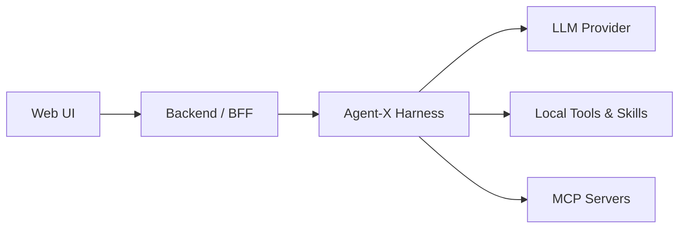

# Agent-X

Agent-X 是一个面向代码、文档与复杂任务的可观察 Agent Runtime。它将可流式交互的 Web UI、
任务后端与单 Agent Harness 分离，形成从用户输入、工具调用到运行事件的完整闭环。

当前 V1 已包含版本化契约、单 Agent 执行核心、会话历史、OpenCode 兼容 Skills，以及 React
Web UI。它基于 `Codex_Agent_Harness_Development_Guide.md` 从零构建，不复用旧实现。

## 特性

- **流式运行**：Harness 产生标准化事件，Backend 通过 SSE 持续推送到 Web UI。
- **可追踪上下文**：记录上下文预算、压缩状态、实际 Token 使用量、工具执行和终止原因。
- **持久会话**：匿名浏览器身份、会话、消息和 Task/Run 映射保存在 SQLite 中。
- **Python 调用**：Bearer API Key 与轻量客户端复用同一套 Task API，无需绕过 Backend 直连 Harness。
- **独立工作区**：每个会话有独立文件工作区；上传文件不会被自动放入模型上下文。
- **Skills**：发现 OpenCode 兼容 `SKILL.md`，按需加载，并对脚本执行施加显式策略、超时和输出限制。
- **MCP Host**：按 Skill 动态接入外部 MCP Server，并把远端工具统一映射到现有 Tool 执行与审计链路。
- **可替换模型**：支持 OpenAI 兼容接口；本地未配置凭据时使用安全且确定性的 EchoProvider。

## 架构



| 模块 | 职责 |
| --- | --- |
| `contracts/` | 版本化的 Task、Run、Event 与 Tool 契约。 |
| `harness/` | Session/Run 生命周期、上下文构造、模型与工具端口、标准事件写入。 |
| `backend/` | 会话归属、历史持久化、文件工作区与对 Web UI 的 SSE/API。 |
| `web/` | Vite + React 前端，只消费公开 API 和事件信封。 |

V1 中 Harness 运行状态保留在进程内；浏览器会话历史、归属、消息和 Harness Run 映射则通过
SQLAlchemy Async 与 Alembic 持久化到 SQLite。

## 本地启动

需要 Python 3.12 和 Node.js：

```bash
python3.12 -m venv .venv && . .venv/bin/activate
pip install -e '.[dev]'
uvicorn harness.app:app --port 8001
# separate terminal
HARNESS_URL=http://127.0.0.1:8001 uvicorn backend.app:app --port 8000
# separate terminal
cd web && npm install && npm run dev
```

首次安装好 Python 与 Web 依赖后，也可以一次启动三个服务：

```bash
./dev.sh
```

它会启动 Harness（`8001`）、Backend（`8000`）和 Web UI（`5173`），日志写入
`LOG_ROOT/services/`；按 `Ctrl+C` 会停止全部子进程。可通过 `HARNESS_PORT`、`BACKEND_PORT`
和 `WEB_PORT` 覆盖端口。

访问 Vite 输出的地址即可使用 Agent-X。复制 `.env.example` 为 `.env` 后填入模型凭据；
没有凭据时 Harness 使用 `EchoProvider` 返回安全、确定性的结果。启动时会校验模型设置、HTTPS
基础地址、上下文窗口、输出预留、工具结果上限、超时和并发配置；密钥不会写入日志。

## 测试

```bash
python -m pytest
```

测试使用脚本化的假 Provider 与 Tool，不需要模型或 MCP 凭据。

## 会话工作区

每个会话都有独立本地工作区：`.data/workspaces/<conversation_id>/`；同一会话内的多个 Task/Run
复用该工作区。UI 默认支持上传、列出和下载最大 25 MiB 的文件；可在 `.env` 配置
`WORKSPACE_ROOT` 与 `WORKSPACE_MAX_FILE_BYTES`。
工作区文件不会自动进入模型上下文。

运行诊断分别以 JSONL 写入 `LOG_ROOT/<session_id>/`，服务标准输出写入
`LOG_ROOT/services/`；两个目录均可配置。

## 持久化会话历史

Backend 在首次访问时创建随机匿名浏览器身份，只把持久化 HttpOnly Cookie 的 SHA-256 哈希写入
SQLite。会话/消息查询、任务控制、SSE 与工作区访问都会在服务端按该身份限制；归属不依赖 IP
地址或浏览器本地存储。Cookie 与 SQLite 路径可通过环境变量配置：

```bash
HISTORY_DB_PATH=.data/agent_history.db
HISTORY_BUSY_TIMEOUT_MS=5000
ANON_COOKIE_SECURE=false # HTTPS 部署时设为 true
```

启动时会创建数据库父目录；SQLite 启用外键、WAL 与配置的忙等待超时，Backend 启动阶段自动执行
Alembic 升级。迁移版本位于 `backend/migrations/`，也可以手动执行
`python -m backend.migrate`。SQLite 适用于单个 Backend 实例；多实例或高并发写入时，应保留
同一 Repository/API 契约并切换至 PostgreSQL。

## Python 脚本调用

Backend 的公开 Task API 同时供 Web UI 和 Python Client 使用。先生成一个至少 32 字符的随机 Key，
并把它配置给 Backend：

```bash
python -c "import secrets; print(secrets.token_urlsafe(32))"
export AGENT_API_KEYS='将上一步生成的随机值填到这里'
HARNESS_URL=http://127.0.0.1:8001 uvicorn backend.app:app --port 8000
```

需要隔离多个脚本用户时，用逗号配置多个 Key。每个 Key 映射为独立且稳定的 principal；原始 Key
不会写入 SQLite。删除或轮换 Key 后，旧 Key 所属历史仍保留，但无法再通过新 Key 访问。

安装本项目后，脚本可以直接阻塞等待 Agent 最终回答：

```python
from agent_x import AgentXClient

with AgentXClient("http://127.0.0.1:8000", api_key="你的 API Key") as client:
    answer = client.ask(
        "ISPPowerOnSensorT 如何调用设备驱动？",
        selected_skills=["code-doc"],
        timeout=300,
    )
    print(answer)
```

`ask()` 内部只组合现有的 `POST /api/tasks` 和 `GET /api/tasks/{task_id}`。如需自行控制生命周期，
可分别调用 `submit()`、`get_task()`、`wait()` 和 `cancel()`；`submit()` 默认生成
`Idempotency-Key`，网络重试时也可以显式复用同一个值。实时事件仍可通过现有
`GET /api/tasks/{task_id}/events` SSE 接口获取。

## Skills

Harness 在每次 Run 开始时，从项目目录下的 `.opencode/skills`、`.claude/skills`、`.agents/skills`
以及对应的全局目录发现 OpenCode 兼容的 `SKILL.md`；项目级 Skill 优先。模型在调用
`load_skill` 前只能看到名称和描述，加载说明不会执行脚本。

`run_skill_script` 是独立的、仅接收 argv 的工具。它只接受已发现的 Skill 名与该 Skill 根目录下的
相对文件路径，默认只允许 `.py` 和 `.sh`，使用受限环境并施加超时、输出与并发限制。项目 Skill
脚本默认遵循 `SKILL_SCRIPT_POLICY=ask`；审阅脚本后才能在可信部署中显式改为 `trusted` 或 `allow`。

## MCP 工具接入

Agent-X 当前作为 MCP Host，支持 `stdio` 与 Streamable HTTP 两种客户端传输。它在 Run 开始时根据
用户选中的 Skill 收集 `tool_groups`，只发现并挂载相应 MCP Server 的工具；远端工具以
`mcp__<server>__<tool>` 命名，继续复用 `ToolPolicy`、并发限制、超时、结果截断和运行事件。

先复制示例配置：

```bash
cp mcp_servers.example.yaml mcp_servers.yaml
```

在需要 MCP 工具的 Skill frontmatter 中声明工具组：

```yaml
---
name: code-doc
description: Search code and documentation.
tool_groups: [code_doc]
---
```

然后在 `mcp_servers.yaml` 中让一个或多个 Server 加入同名工具组。完整的 stdio、Streamable HTTP、
工具白名单、风险级别和环境变量引用示例见 `mcp_servers.example.yaml`。每个 Server 必须显式声明
`risk`；未知字段会让 Harness 启动失败。凭据不要直接写入 YAML：
`env_from` 与 `headers_from_env` 的值是 Agent-X 进程中的环境变量名。例如 HTTP Bearer 值可设置为：

```bash
export KNOWLEDGE_MCP_AUTHORIZATION='Bearer ...'
```

工具 schema 缓存在进程内，默认 300 秒；每次实际调用建立并关闭独立 MCP 连接，避免并发 Run 共享
失效会话。配置的 Server 清单可通过 Harness 的 `GET /internal/mcp/servers` 查看；该接口不返回命令
参数、URL、Header 或环境变量值。未选择声明了 `tool_groups` 的 Skill 时，不会向模型暴露 MCP 工具。

## 业务知识 Wiki MCP

独立的原文 RAG 与 AI Wiki 服务，支持子系统/特性过滤、来源引用和版本校验。
安装、模型配置和 MCP 接入见 [Business Wiki MCP](services/business-wiki-mcp/README.md)。
