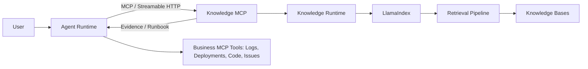
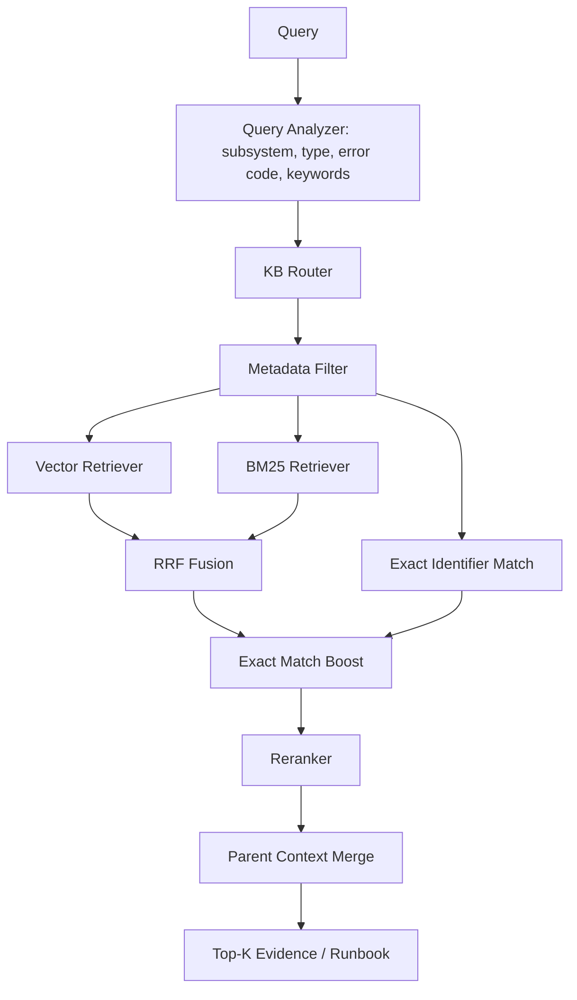

# TroubleShooter Knowledge MCP

Knowledge MCP 是 TroubleShooter 的独立 RAG 服务。它通过 MCP Streamable HTTP 向 Agent Runtime 提供企业知识、Runbook 和文档上下文；Agent Runtime 不依赖 LlamaIndex、Embedding 模型或向量数据库的具体实现。

## 一键 Ingest

将 Markdown 文档放入 `knowledge/<SUBSYSTEM>/<knowledge_type>/` 后，执行下面的命令即可完成扫描、Metadata 解析、LlamaIndex 分层节点构建和检索索引初始化：

```bash
./knowledge-mcp/dev.sh ingest
```

首次使用公开实验语料时，依次执行：

```bash
./knowledge-mcp/dev.sh setup
./knowledge-mcp/dev.sh fetch-datasets
./knowledge-mcp/dev.sh ingest
```

第一阶段使用本地内存索引：`ingest` 会执行完整导入管线并输出文档、节点统计，用于验证语料和索引构建。新增或更新文档后，重新执行该命令，并重启 `serve` 服务；服务会在首次 MCP 调用时按同一导入管线载入最新内容。该能力只提供给管理员 CLI，不作为 MCP Tool 暴露给 LLM Agent，避免 Agent 错误导入、删除或重建知识库。

## 架构



服务边界如下：

| Agent Runtime | Knowledge MCP |
| --- | --- |
| 对话、会话、推理和计划 | 文档导入和元数据规范化 |
| 决定是否调用以及调用哪个业务工具 | 知识库路由与元数据过滤 |
| Tool Permission / Approval Policy | Vector、BM25 和精确匹配检索 |
| 消费 Evidence 与 Runbook 建议 | RRF 融合、重排、父级上下文合并 |
| 组合日志、发布、代码、工单等业务工具 | 检索 Trace、Benchmark 和索引维护 |

Knowledge MCP 从不直接执行生产操作。Runbook 可以影响 Agent 的调查顺序，但不能绕过 Agent Runtime 的工具权限和审批策略。

## 运行时拓扑

Agent Runtime 保持现有 Python 3.9.11 环境。Knowledge MCP 使用独立 Python 3.11+ 环境；本项目已可优先使用本地安装的 Python 3.12.8。

```text
Agent Runtime              Knowledge MCP
Python 3.9.11              Python 3.11+
Port 8000                  Port 8010
     └──── MCP HTTP ────────────► /mcp
```

默认地址为 `http://127.0.0.1:8010/mcp`。本地端口冲突时可通过 `KNOWLEDGE_MCP_PORT` 改用其他端口。

## MCP Tools

Agent 默认只需要知道以下五个工具。

| Tool | 用途 | 主要输入 | 主要输出 |
| --- | --- | --- | --- |
| `search_knowledge` | 搜索普通知识证据 | `query`、可选 `subsystem`、`knowledge_types`、`top_k` | 文档节点、得分、元数据、Trace |
| `search_runbook` | 搜索可信 Runbook | `query`、可选 `subsystem`、`top_k` | Runbook、触发条件、步骤、决策、升级条件 |
| `get_document` | 按稳定 ID 读取完整文档 | `doc_id` | 文档正文和 Metadata |
| `get_context` | 为命中节点补充父级上下文 | `node_id`、`direction=parent` | 父节点或完整上下文 |
| `list_knowledge_bases` | 列出可用知识库 | 无 | 子系统和文档类型 |

示例：

```json
{
  "query": "Our API started returning a large number of 5xx responses after deployment",
  "subsystem": "COMMON",
  "top_k": 5
}
```

`search_runbook` 会返回类似 `RUNBOOK_HIGH_ERROR_RATE` 的结果，并包含建议的首个调查动作，例如检查最近的部署记录。

## 知识库与元数据

文档存放在 `knowledge/<SUBSYSTEM>/<knowledge_type>/`，检索时先按子系统选择知识库，再按文档类型过滤。

```text
knowledge/
├── IS/
│   ├── runbook/
│   ├── issue/
│   └── design_doc/
├── RA/
├── RH/
└── COMMON/
    ├── runbook/
    └── reference/
```

支持的 `knowledge_type` 为 `design_doc`、`runbook`、`issue`、`fault_case`、`reference` 和 `manual`。每个文档或节点包含稳定的 Metadata：

```json
{
  "doc_id": "RUNBOOK_HIGH_ERROR_RATE",
  "title": "High Error Rate",
  "subsystem": "COMMON",
  "knowledge_type": "runbook",
  "source_path": "knowledge/COMMON/runbook/high_error_rate.md",
  "tags": ["5xx", "deployment"],
  "language": "en",
  "trust_level": "curated"
}
```

普通 `design_doc`、`reference`、`manual` 和 `issue` 只作为 Evidence。只有 `knowledge_type=runbook` 且 `trust_level=curated` 的文档会作为 Agent 下一步诊断决策的参考。

## 检索流程



1. **Query Analyzer** 提取子系统、知识类型、错误码和关键字。
2. **KB Router** 优先检索相关子系统；无法判断时可检索 `COMMON` 和多个候选子系统。
3. **Metadata Filter** 用 `subsystem` 与 `knowledge_type` 收窄候选文档。
4. **Hybrid Retrieval** 并行使用 LlamaIndex Vector Retriever 与 BM25。BM25 对 `ECS-004E`、函数名、API 名等标识符更稳定。
5. **RRF Fusion** 使用 Reciprocal Rank Fusion 融合排名，避免直接混合不同检索器的原始分数。
6. **Exact Match Boost** 对错误码和标识符的正文、标签或 Metadata 精确命中给予额外权重。
7. **Reranker** 是独立接口；当前默认 NoOp，可启用 BGE 等 Cross Encoder。
8. **Hierarchy** 使用 LlamaIndex `HierarchicalNodeParser` 将文档切为父子节点：先召回叶节点，再补充父级上下文。

完整检索过程会返回 Trace，包括路由结果、各检索器命中数、融合结果、最终结果和每阶段延迟，便于回归测试与参数调优。

## 数据与导入

第一阶段语料位于 `COMMON`：

- `Incident-response-on-call-agent/runbooks/`：Runbook / SOP；
- `opentelemetry-skill/references/`：普通参考知识。

下载并规范化公开语料：

```bash
./knowledge-mcp/dev.sh fetch-datasets
```

该命令会下载实验仓库到 `datasets/external/`，并将第一阶段需要的 Runbook 和 references 规范化到 `knowledge/COMMON/`。然后构建内存索引：

```bash
./knowledge-mcp/dev.sh ingest
```

`ingest`、`delete`、`reindex` 和 `rebuild` 是管理员能力，仅通过 CLI 或未来的 Admin API 调用，不会暴露给 LLM Agent。

## 安装与启动

```bash
./knowledge-mcp/dev.sh setup
./knowledge-mcp/dev.sh fetch-datasets
./knowledge-mcp/dev.sh ingest
./knowledge-mcp/dev.sh serve
```

`setup` 仅创建 `knowledge-mcp/.venv`，不会修改 Agent Runtime 的 Python 环境。默认离线实验配置使用 `mock` embedding；它适合验证导入、BM25、精确匹配、MCP 协议和评测流程。

准备使用真实语义向量检索时，在 `config.yaml` 设置：

```yaml
embedding:
  provider: huggingface
  model: BAAI/bge-m3
```

然后安装可选模型依赖并重新启动服务：

```bash
cd knowledge-mcp && .venv/bin/python -m pip install -e '.[huggingface]'
./dev.sh serve
```

## Agent Runtime 接入

将示例配置复制为运行时配置，并确认 Knowledge MCP 已启动：

```bash
cp backend/mcp_servers.example.json backend/mcp_servers.json
```

配置中的 Knowledge MCP 使用 Streamable HTTP：

```json
{
  "name": "knowledge",
  "transport": "streamable_http",
  "expose_unprefixed": true,
  "url": "http://localhost:8010/mcp",
  "allowed_tools": [
    "search_knowledge",
    "search_runbook",
    "get_document",
    "get_context",
    "list_knowledge_bases"
  ]
}
```

`expose_unprefixed` 让 Agent 使用稳定的工具名，例如 `search_runbook`，不需要感知 MCP 服务名称。若服务运行在其他端口，同步修改 `url`。

## 配置

所有可调参数集中在 [`config.yaml`](config.yaml)。默认配置包括：

```yaml
retrieval:
  vector:
    enabled: true
    top_k: 30
  bm25:
    enabled: true
    top_k: 30
  exact:
    enabled: true
    boost: 0.25
  fusion:
    strategy: rrf
    k: 60
    top_k: 30
  rerank:
    enabled: false
    top_k: 8
  hierarchy:
    enabled: true
    chunk_sizes: [2048, 512, 256]
```

Embedding Provider、模型、检索数量、RRF 参数、重排和分层大小均不应散落在业务代码中。

## 评测

```bash
./knowledge-mcp/dev.sh eval
```

`evals/retrieval.jsonl` 用于测量 Router Accuracy、Recall@1、Recall@5、Recall@10 和 MRR。`evals/runbook.jsonl` 用于 Runbook 命中和首个建议动作验证。提供 Agent 预测结果时，还可计算 First Tool Accuracy、Next Tool Accuracy 和 Final Decision Accuracy：

```bash
knowledge-mcp/.venv/bin/python knowledge-mcp/scripts/eval_retrieval.py \
  --agent-predictions knowledge-mcp/evals/agent_decision.jsonl
```

评测重点是验证检索是否真正改变 Agent 的下一步工具决策，而不只是判断搜索结果是否相关。

## 项目结构

```text
knowledge-mcp/
├── app/
│   ├── ingestion/       # 加载、Metadata、分层节点与导入管线
│   ├── retrieval/       # Router、Vector、BM25、Exact、RRF、Reranker、Hierarchy
│   ├── runtime/         # Knowledge Runtime
│   ├── tools/           # 五个 MCP Tool 的实现
│   └── server.py        # FastMCP Streamable HTTP Server
├── knowledge/           # 规范化后的知识文档
├── datasets/            # 外部语料和中间数据，默认不提交
├── evals/               # 检索、Runbook 与 Agent 决策评测集
├── scripts/             # 下载、导入、重建与评测 CLI
├── tests/
├── config.yaml
└── pyproject.toml
```

## TODO：持久化知识库

当前实验版本在服务进程内构建本地索引，适合验证检索链路。后续将增加 PostgreSQL + pgvector 持久化实现，使 Ingest 成为可增量、可追踪的入库任务：

- [ ] 新增 `documents`、`nodes`、`node_embeddings`、`ingest_jobs` 和 `index_versions` 表；
- [ ] 使用 pgvector 的 HNSW 或 IVFFlat 索引保存节点向量；
- [ ] 使用 PostgreSQL Full Text Search 支撑关键词、错误码和标识符检索；
- [ ] 支持按 `source_path`、内容哈希和版本进行增量 Ingest、更新与删除；
- [ ] 将 Vector、BM25 和 Document Repository 保持为存储无关接口，支持后续替换为 Qdrant、Milvus 或 pgvector；
- [ ] 增加数据库迁移、持久化 Ingest 集成测试和重启恢复验证。

完成后，Knowledge MCP 重启将直接读取已持久化的索引；Agent Runtime 与五个 MCP Tool 的调用协议无需修改。
